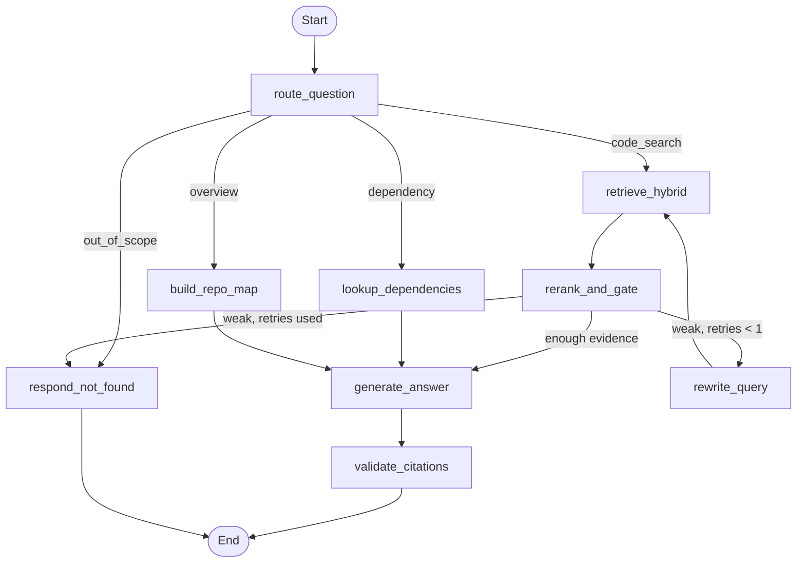

# Hybrid Search Codebase Q&A Bot — Implementation Plan

**Working name:** `CodeQA` (rename freely)
**Author:** Shopnil · **Plan version:** 1.0 · **Date:** September 2026
**Target:** A solo, junior-level, portfolio-grade RAG project that is small enough to finish and rigorous enough to defend in an interview.

---

## Table of Contents

1. [How to Use This Plan](#1-how-to-use-this-plan)
2. [What This Project Proves (Recruiter Signal Map)](#2-what-this-project-proves-recruiter-signal-map)
3. [Scope Guardrails](#3-scope-guardrails)
4. [Revised Tech Stack](#4-revised-tech-stack)
5. [System Architecture](#5-system-architecture)
6. [Key Design Decisions and Viable Approaches](#6-key-design-decisions-and-viable-approaches)
7. [Repository Structure](#7-repository-structure)
8. [Phase-by-Phase Implementation Plan](#8-phase-by-phase-implementation-plan)
9. [Evaluation Protocol](#9-evaluation-protocol)
10. [Software Engineering Standards Checklist](#10-software-engineering-standards-checklist)
11. [Risks and Mitigations](#11-risks-and-mitigations)
12. [Portfolio Packaging](#12-portfolio-packaging)
13. [Stretch Goals (Only After v1 Ships)](#13-stretch-goals-only-after-v1-ships)

---

## 1. How to Use This Plan

**Hardware assumption.** A laptop with 8–16 GB RAM and no dedicated GPU. Everything in the core plan runs on CPU. A GPU only makes the optional local LLM faster.

**Time assumption.** Roughly 15–20 hours per week, part-time. Estimates below are rough; treat them as a pacing guide, not a deadline.

| Milestone | Phases | Rough time | What you can show |
|---|---|---|---|
| **MVP** | 0 → 6, plus the CLI part of Phase 7 | ~6 weeks | CLI that indexes a repo and answers questions with cited file:line sources, plus a retrieval ablation table |
| **v1 (portfolio-ready)** | 7 → 9 | +3–4 weeks | Web UI, Dockerized stack, CI, generation evaluation, polished README |

**The one rule that matters most:** build and measure retrieval *before* you touch the LLM. Most RAG failures are retrieval failures, and a project that shows you understand this stands out immediately.

**Each phase has the same shape:** Goal → Tasks → Definition of Done → Concepts you will learn → Pitfalls. Do not start a phase until the previous phase's Definition of Done is met and committed.

---

## 2. What This Project Proves (Recruiter Signal Map)

Junior AI engineering candidates are usually filtered on three questions: *Can they build a working LLM system end to end? Do they understand why it works or fails? Can they write code a team could maintain?* Every major component below maps to one of these.

| Component | Signal it sends | Why it matters to a reviewer |
|---|---|---|
| AST-based chunking (tree-sitter) | Domain-aware data preparation | Shows you know chunking is a design decision, not a default |
| Hybrid search (BM25 + dense + RRF) | Retrieval fundamentals | Code is full of exact identifiers that dense-only search misses |
| Identifier-aware tokenization | Attention to detail | `getUserById` must match "get user by id" |
| Retrieval evaluation with ablations | Evaluation-driven development | The single strongest differentiator at junior level |
| Held-out evaluation repo | Scientific rigor | Proves you didn't tune on your test set |
| Exact source attribution + validation | Grounding and trust | Every answer is traceable to `file.py:L42-L67` |
| Abstention ("not found in the codebase") | Hallucination control | Knowing when not to answer is a production skill |
| LangGraph with a bounded retry loop | Controlled agentic behavior | Shows orchestration without "agent soup" |
| Postgres for metadata, jobs, logs, call graph | Data modeling | The vector DB is an index, not a source of truth |
| FastAPI + CLI + Web UI over one service layer | Clean architecture | Same core logic, three interfaces |
| Tests, CI, Docker, migrations, ADRs | Engineering maturity | You can work in a real codebase |
| "What didn't work" section | Honesty and learning | Senior reviewers find this more credible than perfect numbers |

**Portfolio narrative.** This project complements work you already have: LexVault (document RAG with pgvector) and MarketSense AI (multi-agent LangGraph). CodeQA adds *structure-aware retrieval over code*, *native hybrid search in a dedicated vector DB*, and *rigorous retrieval evaluation*. Together they tell a coherent "I build and evaluate retrieval systems" story rather than three unrelated demos.

---

## 3. Scope Guardrails

### In scope (v1)

- **One language done well: Python.** The chunker is designed so adding JavaScript/TypeScript later is a new module, not a rewrite.
- Index a **local folder or a public GitHub repo** (shallow clone).
- Three question types: **code search/explanation**, **dependency lookup** ("what calls X?"), and **project overview** ("how is this repo structured?").
- Hybrid retrieval, optional reranking, grounded generation with citations, abstention.
- CLI, REST API, simple web UI.
- Retrieval and generation evaluation with a small, hand-built golden dataset.
- Docker Compose for the whole stack, GitHub Actions CI.

### Explicitly out of scope (do not build these)

| Tempting feature | Why it is out |
|---|---|
| Multi-agent system / agent swarm | Adds complexity without improving retrieval quality; you already have a multi-agent project |
| Authentication, users, multi-tenancy | Standard web work, not AI engineering signal |
| Kubernetes, Celery, Redis, message queues | Senior-level infra; FastAPI background tasks are enough |
| Full GraphRAG / Neo4j knowledge graph | A simple call-edge table in Postgres gives 80% of the value |
| Fine-tuning embeddings or LLMs | Out of proportion for a junior portfolio project |
| Perfect cross-file symbol resolution | Real type inference is a research problem; do best-effort name matching and document the limitation |
| Supporting 10 languages | One language with good evaluation beats ten languages with none |
| A polished Next.js frontend in v1 | Moved to stretch goals; Streamlit is enough for v1 |

---

## 4. Revised Tech Stack

### 4.1 Changes from your original draft

1. **Filled the gaps** for embeddings and LLM with CPU-friendly, currently available options.
2. **Chose Qdrant over LanceDB** (reasoning in Section 6.4).
3. **Gave PostgreSQL a real job**: metadata, indexing jobs, a call-graph table, query logs, feedback, and evaluation runs. Without a real job, Postgres looks decorative to a reviewer.
4. **Added the pieces recruiters look for**: an optional reranker, identifier-aware BM25, an evaluation harness, and observability.
5. **Picked Streamlit** for the v1 UI so your time goes into retrieval quality, not CSS.

### 4.2 Final stack

| Layer | Choice | Why | Alternative |
|---|---|---|---|
| Runtime and packaging | Python 3.12, **uv** (lockfile) | Fast, reproducible installs | Poetry |
| Code quality | **ruff** (lint + format), **mypy**, **pre-commit** | Industry standard, cheap to adopt | pyright |
| Testing | **pytest**, pytest-cov, FastAPI `TestClient` | Standard | — |
| Code parsing | **tree-sitter** + `tree-sitter-python` grammar | Error-tolerant, multi-language AST parser | `tree-sitter-language-pack` (many grammars in one package) |
| Dense embeddings | **fastembed** (ONNX, CPU) with `jinaai/jina-embeddings-v2-base-code` (768-d, 8K context, code-trained) | Runs well on CPU, low RAM, trained on code/docstring pairs | `BAAI/bge-small-en-v1.5` as a tiny general-purpose baseline; `jina-code-embeddings-0.5b` via sentence-transformers if you have RAM to spare |
| Sparse (keyword) | fastembed `Qdrant/bm25` + Qdrant **IDF modifier** + your identifier-splitting preprocessor | BM25 inside the same DB, no second search engine | `bm25s` library with in-Python fusion |
| Vector DB | **Qdrant** in Docker (pinned version); local mode for tests | Native dense + sparse vectors and fusion in one query | LanceDB (embedded), pgvector |
| Reranker (optional) | fastembed `TextCrossEncoder`: `jinaai/jina-reranker-v1-tiny-en` (small, Apache-2.0) or `jinaai/jina-reranker-v2-base-multilingual` (code-search aware, **CC-BY-NC**: fine for a portfolio, not for commercial use) | Cheap precision boost on top-30 candidates | Skip it if your ablation shows no gain |
| Orchestration | **LangGraph 1.x** | Explicit, testable state machine | Plain Python functions |
| LLM access | LangChain chat-model integrations behind your own small `get_llm()` factory | Swap providers via config | LiteLLM |
| LLM (development) | A hosted free-tier API (e.g., Groq or Google Gemini; check current limits) | Fast iteration on weak hardware | — |
| LLM (fully local mode) | **Ollama** with a small instruct model: Qwen 2.5 Coder 7B if you have ~8 GB VRAM, or a 3–4B Qwen3-family model on CPU only (check the Ollama library for current tags) | Demonstrates offline capability | llama.cpp directly |
| Metadata DB | **PostgreSQL 16**, SQLAlchemy 2.0, **Alembic**, psycopg 3 | Relational metadata, graph edges, logs | SQLite (too limited for the story) |
| API | **FastAPI**, Pydantic v2, pydantic-settings | Standard for Python AI services | — |
| CLI | **Typer** + **Rich** | Clean commands, pretty output | Click |
| Web UI | **Streamlit** (thin client over the API) | Fastest path to a usable demo | Next.js (stretch goal; you already know it) |
| Background jobs | FastAPI `BackgroundTasks` + a `index_jobs` table | Enough for one user; no Celery | — |
| Observability | **structlog** JSON logs + per-stage timings stored in Postgres | Simple and inspectable | Langfuse or LangSmith (optional) |
| Evaluation | Custom harness (plain Python) + LLM-as-judge | Transparent, you understand every number | Ragas (optional, later) |
| Deployment | Multi-stage Dockerfile, **Docker Compose**, **GitHub Actions** | Reproducible, reviewer can run it | — |

> **Version note.** tree-sitter's Python bindings, fastembed, and LangGraph have all changed APIs across versions. Pin exact versions in `pyproject.toml`, and read the docs for the version you pinned rather than older tutorials.

---

## 5. System Architecture

### 5.1 Component diagram

```
 ┌───────────────────────── Interfaces ─────────────────────────┐
 │   CLI (Typer)                          Web UI (Streamlit)    │
 └──────┬───────────────────────────────────────┬───────────────┘
        │ calls services in-process              │ HTTP (JSON)
        │                                        ▼
        │                        ┌──────────── FastAPI ────────────┐
        │                        │ /repositories /jobs /query      │
        │                        │ /search /feedback /health       │
        │                        └───────────────┬─────────────────┘
        ▼                                        ▼
 ┌──────────────────────────── Service layer ────────────────────────────┐
 │  IndexingService                          QueryService                │
 │  loader → walker → chunker →              LangGraph pipeline          │
 │  edge extractor → embedder → writer       route → retrieve/lookup →   │
 │                                           rerank+gate → generate →    │
 │                                           validate citations          │
 └──────┬─────────────────────┬──────────────────────┬───────────────────┘
        ▼                     ▼                      ▼
 ┌─────────────┐   ┌──────────────────────┐   ┌──────────────────────┐
 │   Qdrant    │   │     PostgreSQL       │   │  LLM provider        │
 │ dense+sparse│   │ repos, files, chunks │   │  hosted API / Ollama │
 │  vectors    │   │ symbol_edges, jobs,  │   └──────────────────────┘
 │ + payload   │   │ query_logs, feedback │
 └─────────────┘   └──────────────────────┘
```

**Layering rule:** interfaces (CLI, API) → services → domain logic (chunking, retrieval, graph) → adapters (Qdrant, Postgres, LLM). Dependencies only point downward. Adapters sit behind small Python `Protocol` interfaces so tests can use fakes.

### 5.2 Indexing flow

1. **Resolve source.** Local path, or `git clone --depth 1` into a cache folder. Record the commit SHA (needed for permalinks and reproducible evaluation).
2. **Walk files.** Respect `.gitignore` (use `pathspec`), skip binaries, lock files, vendored folders (`node_modules`, `.venv`, `dist`), files over a size limit, and anything that looks like a secret (`.env`, `*.pem`).
3. **Hash each file** (SHA-256). Unchanged files are skipped on re-index (Phase 8).
4. **Parse and chunk.** Python files go through the AST chunker; Markdown and other text go through a fallback chunker.
5. **Extract edges.** Calls and imports from each function/method become rows in `symbol_edges`.
6. **Build two texts per chunk.** An *embedding text* (context header + code) and a *sparse text* (identifier-expanded).
7. **Embed in batches** (dense and sparse), upsert into Qdrant, and write chunk rows and edges to Postgres in one transaction per file.
8. **Update the job row** with progress, counts, and any errors.

### 5.3 Query flow

1. **Route** the question: `code_search`, `dependency`, `overview`, or `out_of_scope`.
2. **code_search:** hybrid retrieve top-30 → rerank → keep top-6 → *evidence gate*. If evidence is weak, rewrite the query once and retry. If still weak, answer "I couldn't find this in the indexed code."
3. **dependency:** extract the symbol name → SQL lookup of callers/callees (depth ≤ 2) → fetch those chunks.
4. **overview:** build a compact *repo map* (directory tree + top-level symbols + README sections).
5. **Generate** an answer from numbered sources `[1]…[n]`.
6. **Validate citations**, attach `file:line` ranges and GitHub permalinks, and log everything.

### 5.4 LangGraph flow



The loop is **bounded to one retry**. This is deliberate: it demonstrates corrective RAG without runaway cost or latency.

### 5.5 Data model (PostgreSQL)

| Table | Key columns | Purpose |
|---|---|---|
| `repositories` | `id`, `name`, `source_url`, `local_path`, `commit_sha`, `status`, `last_indexed_at` | One row per indexed repo |
| `index_jobs` | `id`, `repository_id`, `status`, `started_at`, `finished_at`, `files_processed`, `chunks_created`, `error` | Background job tracking |
| `files` | `id`, `repository_id`, `path`, `language`, `content_hash`, `size_bytes`, `indexed_at` | Incremental re-indexing |
| `chunks` | `id` (UUID), `file_id`, `repository_id`, `kind`, `symbol_name`, `qualified_name`, `parent_name`, `signature`, `docstring`, `start_line`, `end_line`, `content`, `token_count`, `content_hash` | Source of truth for chunk metadata |
| `symbol_edges` | `id`, `repository_id`, `source_chunk_id`, `target_name`, `kind` (`call`/`import`), `target_chunk_id` (nullable) | Best-effort call graph |
| `query_logs` | `id`, `repository_id`, `question`, `route`, `retrieved_chunk_ids` (JSONB), `answer`, `citations` (JSONB), `grounded`, `stage_latency_ms` (JSONB), `model`, `prompt_version`, `created_at` | Observability and debugging |
| `feedback` | `id`, `query_log_id`, `rating`, `comment` | User signal |
| `eval_runs` | `id`, `config` (JSONB), `dataset`, `metrics` (JSONB), `git_sha`, `created_at` | Reproducible evaluation history |

**Chunk IDs are deterministic:** `uuid5(NAMESPACE, f"{repo_id}|{path}|{qualified_name}|{part_index}")`. The same ID is used in Postgres and Qdrant, which makes re-indexing idempotent (upsert instead of duplicate).

**Qdrant payload** stores what retrieval needs to return results without a second round trip: `repo_id`, `path`, `language`, `kind`, `qualified_name`, `start_line`, `end_line`, `content`. Postgres remains the source of truth; Qdrant can always be rebuilt.

---

## 6. Key Design Decisions and Viable Approaches

Each decision below becomes a short ADR (Architecture Decision Record) in `docs/adr/`. Interviewers love asking "why did you choose X?", and these give you prepared answers.

### 6.1 Chunking strategy

| Approach | How it works | Pros | Cons |
|---|---|---|---|
| Fixed-size text splitter | Every N characters/lines with overlap | Trivial | Cuts functions in half; retrieval returns fragments |
| Language-aware recursive splitter | Split on `\nclass`, `\ndef`, etc. | Better than fixed | Regex-based, breaks on decorators/nesting |
| **AST-based (tree-sitter)** ✅ | Parse the file, emit one chunk per function/method/class | Chunks are complete semantic units with rich metadata | More code to write |

**Decision:** AST-based, with the fixed-size splitter kept **only as an evaluation baseline**. The comparison between the two is one of your headline results.

**Chunk units for Python:**

- **Function** (top-level `def`), including its decorators.
- **Method**, with a header naming its parent class.
- **Class skeleton**: class signature, docstring, class attributes, and *method signatures only* (no bodies). This answers "what does this class do?" without duplicating every method body.
- **Module chunk**: module docstring, imports, and top-level statements that are not inside a function or class (capped in size).
- **Large nodes** (over ~800–1,000 tokens): split at statement boundaries inside the body; every part repeats the signature line so it stays understandable.

**Embedding text template** (the "context header" trick):

```text
# File: httpx/_client.py
# Symbol: Client.send (method of Client)
# Signature: def send(self, request, *, stream=False, auth=..., follow_redirects=...)
<original code>
```

The header lets the embedding model "know" where the code lives, which helps questions that mention file or class names.

### 6.2 Sparse retrieval for code

Standard BM25 tokenizers are built for English. Code needs one extra step: **identifier splitting**, applied identically to documents and queries.

| Raw identifier | Tokens emitted |
|---|---|
| `getUserByID` | `getuserbyid get user by id` |
| `HTTPServerError` | `httpservererror http server error` |
| `parse_json_v2` | `parse_json_v2 parse json v 2` |

This lets a natural-language query ("where do we parse JSON") hit `parse_json_v2`, while an exact query (`parse_json_v2`) still gets an exact-token match.

### 6.3 Fusing sparse and dense results

| Approach | Notes |
|---|---|
| Weighted sum of scores | Scores are on different scales (BM25 is unbounded, cosine is −1…1); requires normalization and tuning |
| Distribution-based fusion (Qdrant DBSF) | Normalizes by score distribution; a reasonable second option |
| **Reciprocal Rank Fusion (RRF)** ✅ | Uses ranks, not scores: `score(d) = Σ 1 / (k + rank_i(d))`. No tuning, robust default |

**Decision:** RRF. **Learning step:** implement RRF yourself in ten lines first, then switch to Qdrant's native fusion and check that the top results broadly agree. Being able to explain RRF on a whiteboard is a common interview question.

### 6.4 Vector database

| Option | Pros | Cons |
|---|---|---|
| **Qdrant (Docker)** ✅ | Native dense + sparse vectors, server-side IDF, fusion and filtering in one query; local in-memory mode for tests; widely recognized | One more container |
| LanceDB (embedded) | Zero infrastructure, low RAM, has full-text search and hybrid | Less "service architecture" to show; hybrid path is less standard |
| pgvector (in Postgres) | One database for everything | You already showcase pgvector in LexVault; Postgres full-text search tokenizes code poorly |

**Decision:** Qdrant. It keeps hybrid search inside one query and adds breadth to your portfolio.

### 6.5 Embedding model

| Option | Size | Notes |
|---|---|---|
| `BAAI/bge-small-en-v1.5` | tiny, 384-d | General English; your **baseline** |
| **`jinaai/jina-embeddings-v2-base-code`** ✅ | ~160M params, 768-d, 8K context | Trained on code and docstring pairs; runs on CPU via fastembed |
| `jina-code-embeddings-0.5b` | ~0.5B params | Newer and likely stronger, but heavier on CPU and loaded via sentence-transformers; check its license |
| Hosted APIs (e.g., Voyage code models) | — | Strong, but breaks the "local" story and costs money |

**Decision:** jina v2 code as default, bge-small as baseline. Put the embedder behind an interface so swapping models is a config change, then **let the ablation decide** instead of assuming.

### 6.6 Reranking and the evidence gate

Two ways to decide "is the retrieved context good enough to answer?":

| Approach | Cost | Notes |
|---|---|---|
| LLM grades each chunk (classic corrective RAG) | One LLM call per chunk | Slow and expensive on a small local model |
| **Cross-encoder reranker score threshold** ✅ | One small-model pass over ~30 pairs | Deterministic, fast on CPU, threshold can be calibrated on your dev set |

**Decision:** reranker + threshold. **Caveat to test:** many small rerankers are trained on web search data, not code. It is entirely possible the reranker does not help. If so, report that honestly; it is a great "what didn't work" finding.

### 6.7 Query routing

| Approach | Pros | Cons |
|---|---|---|
| **Rule-based router** ✅ (v1) | Deterministic, free, unit-testable | Misses unusual phrasings |
| LLM router with structured output | Handles phrasing variety | Costs a call; small models sometimes break the schema |

**Decision:** start with rules ("who calls", "what calls", "used by", "depends on" → dependency; "structure", "architecture", "overview" → overview). Label the route for each golden-set question, measure routing accuracy, and upgrade to an LLM router *only if* the numbers justify it. That is evaluation-driven development in a nutshell.

### 6.8 LLM hosting

**Decision:** a provider factory selected by config (`LLM_PROVIDER=groq|gemini|ollama`). Use a hosted free tier during development for speed; demonstrate local mode with Ollama in the README. Keep answer prompts short, because small models degrade quickly with long contexts: aim for a context budget of roughly 4–6K tokens.

### 6.9 Orchestration: why LangGraph at all?

A plain function pipeline would work for straight-line RAG. LangGraph earns its place here because the flow has **branches** (three routes plus refusal) and a **bounded loop** (query rewrite). It also gives you a visualizable graph for your README, and it is a framework recruiters actively search for. Keep nodes as plain, individually testable functions so the framework never hides your logic.

### 6.10 Source attribution

- Context is passed to the LLM as numbered blocks: `[3] httpx/_client.py L812-L870 (Client.send)`.
- The prompt requires a citation marker after every factual claim.
- A validator parses markers with a regex (more robust than JSON output on small models), drops out-of-range numbers, and flags answers with zero citations as `grounded = false`.
- Each citation becomes a clickable GitHub permalink pinned to the indexed commit: `https://github.com/{owner}/{repo}/blob/{sha}/{path}#L{start}-L{end}`. For local repos, output `path:line`, which most editors can open directly.


---

## 7. Repository Structure

```
codeqa/
├── README.md                     # The most important file in the repo (see §12)
├── pyproject.toml                # deps, ruff, mypy, pytest config
├── uv.lock
├── .env.example                  # every config key, no secrets
├── .pre-commit-config.yaml
├── Makefile                      # make dev / test / lint / index / eval / up
├── docker-compose.yml            # api + ui + qdrant + postgres
├── Dockerfile                    # multi-stage build
├── alembic.ini
├── migrations/                   # Alembic versions
│
├── src/codeqa/
│   ├── config.py                 # pydantic-settings, single source of config
│   ├── logging.py                # structlog setup
│   ├── models/                   # SQLAlchemy models + Pydantic schemas
│   ├── db/                       # session, repositories (data-access objects)
│   │
│   ├── ingest/
│   │   ├── source.py             # local path or shallow git clone, commit SHA
│   │   ├── walker.py             # gitignore, binary/size/secret filters
│   │   ├── chunkers/
│   │   │   ├── base.py           # Chunker Protocol + Chunk dataclass
│   │   │   ├── python_ast.py     # tree-sitter chunker (the centrepiece)
│   │   │   ├── fixed.py          # baseline splitter, for ablation
│   │   │   └── markdown.py       # header-based fallback
│   │   ├── edges.py              # call/import extraction -> symbol_edges
│   │   └── pipeline.py           # IndexingService orchestration
│   │
│   ├── retrieval/
│   │   ├── embedder.py           # dense (fastembed), behind a Protocol
│   │   ├── sparse.py             # identifier splitting + BM25 vectors
│   │   ├── store.py              # Qdrant adapter (upsert, hybrid query, filters)
│   │   ├── fusion.py             # your own RRF implementation
│   │   ├── reranker.py           # cross-encoder, optional
│   │   └── search.py             # SearchService: the single retrieval entrypoint
│   │
│   ├── graph/
│   │   ├── state.py              # LangGraph state TypedDict
│   │   ├── nodes.py              # plain functions, unit-testable
│   │   ├── prompts/              # versioned prompt templates (v1.md, v2.md…)
│   │   ├── llm.py                # provider factory (groq | gemini | ollama)
│   │   └── pipeline.py           # graph wiring
│   │
│   ├── api/
│   │   ├── main.py               # FastAPI app, lifespan, exception handlers
│   │   ├── routes/               # repositories, jobs, query, search, feedback, health
│   │   └── deps.py
│   │
│   ├── cli/main.py               # Typer: index, ask, search, status, eval
│   └── ui/app.py                 # Streamlit client (HTTP only)
│
├── eval/
│   ├── datasets/
│   │   ├── dev_questions.yaml    # ~40 questions on the dev repo
│   │   └── heldout_questions.yaml# ~20 questions on a repo you never tuned on
│   ├── run_retrieval.py          # Recall@k, MRR, nDCG per config
│   ├── run_generation.py         # groundedness / correctness / abstention
│   └── results/                  # committed JSON + markdown tables
│
├── tests/
│   ├── fixtures/sample_code/     # small hand-written .py files with known structure
│   ├── unit/                     # chunker, identifier splitter, RRF, router, validator
│   └── integration/              # Qdrant local mode, API TestClient, fake LLM
│
└── docs/
    ├── adr/                      # 0001-ast-chunking.md, 0002-qdrant.md, …
    ├── architecture.md
    ├── evaluation.md             # method + results + what didn't work
    └── images/                   # diagrams, CLI gif, UI screenshots
```

**Why this layout matters.** A reviewer opening your repo sees, in five seconds: a src layout, separated concerns, a real test directory, migrations, an eval harness, and ADRs. That impression forms before they read a single line of code.

---

## 8. Phase-by-Phase Implementation Plan

### Phase 0 — Project skeleton (2–4 days)

**Goal:** a repository that already looks professional before it does anything useful.

**Tasks**

1. `uv init`, Python 3.12, src layout, install ruff, mypy, pytest, pre-commit.
2. `config.py` with pydantic-settings; `.env.example` listing every key.
3. `logging.py` with structlog (JSON in production, pretty in development).
4. `docker-compose.yml` with Postgres and Qdrant (pinned image tags, named volumes).
5. Alembic initialised; first migration creates `repositories`, `files`, `chunks`, `index_jobs`.
6. A `Makefile` with `up`, `down`, `test`, `lint`, `migrate`.
7. GitHub repo, `main` branch protected, a real `.gitignore`, MIT licence.
8. One trivial test so CI is green from day one.

**Definition of Done:** `make up` starts both services; `make test` and `make lint` pass; `alembic upgrade head` creates the tables.

**Concepts:** twelve-factor configuration, dependency locking, migrations as code.

**Pitfalls:** do not hand-write SQL DDL — start with Alembic or you will regret it in Phase 8. Do not commit `.env`.

---

### Phase 1 — Ingestion and AST chunking (1–1.5 weeks) ⭐ *the differentiator*

**Goal:** turn a Python repo into clean, complete, metadata-rich chunks.

**Tasks**

1. **Source resolution** (`source.py`): accept a local path or a GitHub URL; shallow clone into a cache directory; capture `commit_sha`, owner, and repo name.
2. **File walker** (`walker.py`): honour `.gitignore` via `pathspec`; skip binaries, `node_modules`, `.venv`, `dist`, `build`, migrations, minified files, files over ~1 MB, and secret-looking files; compute a SHA-256 per file.
3. **Chunk contract** (`chunkers/base.py`): a `Chunk` dataclass carrying `kind`, `symbol_name`, `qualified_name`, `parent_name`, `signature`, `docstring`, `start_line`, `end_line`, `content`, plus a `Chunker` Protocol.
4. **tree-sitter chunker** (`python_ast.py`):
   - Parse with `tree_sitter_python`; walk the tree for `function_definition` and `class_definition`, keeping `decorated_definition` wrappers attached.
   - Track the enclosing class to build `qualified_name` (`Client.send`) and `parent_name`.
   - Emit a **class skeleton** chunk (signature, docstring, attributes, method signatures) separately from method chunks.
   - Emit a **module** chunk from the module docstring, imports, and top-level statements.
   - Split oversized nodes at statement boundaries, repeating the signature in every part.
   - Never drop code: assert that the union of chunk line ranges covers all non-blank lines that belong to a definition.
5. **Markdown fallback** (`markdown.py`): split on headers, keep the header path as context.
6. **Fixed-size baseline** (`fixed.py`): ~60 lines with 10 lines of overlap. Needed for the ablation.
7. **Edge extraction** (`edges.py`): within each function body, collect `call` nodes and resolve the callee's plain name; collect module-level imports. Write `symbol_edges` rows with `target_name` as text; resolve `target_chunk_id` afterwards by matching names within the repo (prefer same-file, then unique repo-wide match; leave ambiguous ones unresolved).
8. **CLI:** `codeqa chunk <path> --limit 20` prints chunks with metadata for eyeballing.

**Definition of Done**

- Unit tests on `tests/fixtures/sample_code/` assert exact chunk counts, names, and line ranges for: nested classes, decorated functions, async functions, a 400-line function, a file with a syntax error (tree-sitter must degrade, not crash), and an empty file.
- Running the chunker over a real 5,000-line repo produces zero crashes and a plausible chunk-size histogram (print min/median/p95/max).
- A comparison snippet in `docs/` shows the same function chunked by fixed-size (broken) versus AST (intact).

**Concepts:** concrete syntax trees, node cursors, chunk granularity, metadata-enriched embedding text.

**Pitfalls**

- tree-sitter byte offsets are **UTF-8 bytes**, not characters. Slice `bytes`, then decode, or non-ASCII files will silently corrupt.
- Decorators live in a parent node; grab them or you lose `@app.get("/users")`, which is exactly what people search for.
- Resist perfect call resolution. Name matching plus an honest limitations note is the right scope.

---

### Phase 2 — Embeddings and the vector store (4–6 days)

**Goal:** chunks become searchable dense and sparse vectors.

**Tasks**

1. **Embedder** (`embedder.py`): fastembed `TextEmbedding` with the jina code model, batched, behind an `Embedder` Protocol with a `dim` property. Cache the model locally; log throughput (chunks/second) — you will quote this number in your README.
2. **Sparse** (`sparse.py`): the identifier splitter (camelCase, snake_case, PascalCase, digits) plus fastembed's BM25 model. Unit-test the splitter against a table of tricky identifiers.
3. **Two texts per chunk:** `embedding_text` (context header + code) and `sparse_text` (identifier-expanded code + qualified name + docstring).
4. **Qdrant adapter** (`store.py`): create the collection with a named dense vector and a named sparse vector (IDF modifier enabled); deterministic UUID point IDs; batched upsert; payload indexes on `repo_id`, `path`, `language`, `kind`.
5. **Wire the pipeline** (`ingest/pipeline.py`): walk → chunk → embed → upsert → write Postgres rows → update `index_jobs`. Resume-safe: a crash mid-run must not corrupt state.
6. **CLI:** `codeqa index <path-or-url> --repo-name x` with a Rich progress bar.

**Definition of Done:** indexing a mid-size repo (roughly 3,000–10,000 chunks) completes on your laptop; Postgres chunk count equals the Qdrant point count; re-running the same command produces the same counts, not duplicates.

**Concepts:** dense vs sparse representations, IDF, batching, idempotent writes.

**Pitfalls:** loading the embedding model per batch (load once, reuse); forgetting that dense and sparse vectors must be named consistently between upsert and query; letting `content` in the payload balloon memory (cap very long chunks).

---

### Phase 3 — Hybrid retrieval (4–6 days)

**Goal:** a single `SearchService.search()` that any interface can call.

**Tasks**

1. Implement **RRF yourself** in `fusion.py` (`k = 60`), with unit tests on synthetic rank lists.
2. Add three retrieval modes to the store adapter: `dense`, `sparse`, `hybrid` (Qdrant server-side fusion) — the ablation needs all three.
3. Filters: by `repo_id` always; optionally by `path` prefix, `language`, or `kind`.
4. `SearchService.search(query, repo, mode, top_k, filters)` returns typed `SearchResult` objects with score, rank, and full chunk metadata.
5. **CLI:** `codeqa search "how are retries handled" --mode hybrid --top-k 10`, rendering results as `path:Lstart-Lend  (qualified_name)  score` with a syntax-highlighted snippet.
6. Log per-stage latency for every search.

**Definition of Done:** all three modes run end to end; a hand-picked set of ten queries shows the expected pattern — exact identifier queries win on sparse, conceptual queries win on dense, hybrid is rarely worst. Write this observation down; it becomes README material.

**Concepts:** lexical vs semantic matching, rank fusion, filtered vector search.

**Pitfalls:** applying identifier splitting to documents but not to queries (or vice versa) silently destroys sparse recall — test both paths with the same function.

---

### Phase 4 — Evaluation harness (4–6 days) ⭐ *the strongest hiring signal*

Build this **before** the LLM pipeline. It is the difference between "I made a chatbot" and "I engineered a retrieval system."

**Tasks**

1. **Pick two repos.** A *dev* repo you tune on (a mid-size, readable OSS Python project) and a *held-out* repo you will not look at until Phase 9. Pin both by commit SHA.
2. **Build `dev_questions.yaml` (~40 questions)** by hand. Each entry:

   ```yaml
   - id: q014
     question: "Where is the retry backoff interval calculated?"
     route: code_search
     relevant:                      # ground truth, as file + symbol
       - path: "src/http/retry.py"
         symbol: "RetryPolicy._backoff"
     difficulty: medium
     type: conceptual               # conceptual | exact_identifier | dependency | overview
   ```

   Aim for a spread: ~15 conceptual, ~10 exact-identifier, ~8 dependency, ~5 overview, ~2 unanswerable (the correct answer is abstention).
3. **Metrics** (`run_retrieval.py`): Recall@5, Recall@10, MRR, nDCG@10, and mean latency. A retrieved chunk counts as relevant if its `qualified_name` matches, or if its line range overlaps the ground-truth symbol's range.
4. **Ablation matrix** — run every configuration and write results to `eval/results/` plus a markdown table:

   | Dimension | Variants |
   |---|---|
   | Chunking | fixed-size vs AST |
   | Retrieval | dense vs sparse vs hybrid (RRF) |
   | Embedding model | bge-small vs jina-code |
   | Reranker | off vs on (added in Phase 5) |

5. Record each run in `eval_runs` with its config and the current git SHA.

**Definition of Done:** `make eval-retrieval` regenerates every number from scratch; the results table is committed; you can state in one sentence which configuration wins and by how much, broken down by question type.

**Concepts:** offline evaluation, ranking metrics, ablation studies, reproducibility.

**Pitfalls**

- Do not let an LLM invent your ground truth. Hand-labelling 40 questions takes a long evening and is the most valuable evening of the project.
- Report per-question-type results. The interesting finding is usually "hybrid barely helps overall but dramatically helps exact-identifier queries."
- Never tune on the held-out repo. Its whole value is that you didn't.

---

### Phase 5 — Reranking and the evidence gate (3–4 days)

**Tasks**

1. `reranker.py`: fastembed `TextCrossEncoder`, rerank the top-30 candidates down to the top-6, lazily loaded and toggled by config.
2. Re-run the Phase 4 ablation with reranking on and off. Measure the latency cost too.
3. Calibrate an evidence threshold on the dev set: pick the score cutoff that best separates answerable from unanswerable questions, and record the false-abstention rate.
4. Decide from the data: keep it, or disable it by default and write up why.

**Definition of Done:** a documented decision backed by a before/after table, including latency.

**Pitfalls:** cross-encoders are much slower than bi-encoders — never rerank more than ~30 candidates on CPU. Do not keep the reranker just because it sounds impressive; a documented "it didn't help on code, here is the evidence" is a *better* interview story.

---

### Phase 6 — LangGraph pipeline and grounded generation (1–1.5 weeks)

**Tasks**

1. **State** (`state.py`): question, repo_id, route, query variants, candidates, selected context, answer, citations, grounded flag, retry count, stage timings.
2. **Nodes** (`nodes.py`), each a plain function:
   - `route_question` — rule-based classifier.
   - `retrieve_hybrid` — calls `SearchService`.
   - `rerank_and_gate` — rerank, then decide `sufficient` / `retry` / `abstain`.
   - `rewrite_query` — one LLM call that rephrases the question with code vocabulary; **bounded to one retry**.
   - `lookup_dependencies` — SQL over `symbol_edges` (depth ≤ 2), then fetch those chunks.
   - `build_repo_map` — directory tree + top-level symbols + README headings, size-capped.
   - `generate_answer` — the main prompt.
   - `validate_citations` — regex-parse `[n]` markers, drop invalid indices, set `grounded`.
   - `respond_not_found` — the abstention path.
3. **Prompts** (`graph/prompts/`), versioned as files, not inline strings. The answer prompt must: use only the numbered sources; cite after every claim; say plainly when the answer is not in the context; and prefer quoting real identifiers over paraphrasing.
4. **Context budget:** cap total context tokens (~4–6K); truncate long chunks from the middle, keeping the signature and docstring.
5. **LLM factory** (`llm.py`): `groq | gemini | ollama` by config, with a timeout, one retry on transient failure, and a `FakeLLM` for tests.
6. **Log every query** to `query_logs` with stage latencies, model, and prompt version.
7. **CLI:** `codeqa ask "how does the client handle redirects?" --repo httpx`, streaming the answer and printing a citations table.

**Definition of Done:** all three routes produce grounded answers with valid citations on the dev repo; an unanswerable question reliably abstains; `query_logs` fills correctly; every node has a unit test using fakes (no network calls in the test suite).

**Concepts:** graph-based orchestration, conditional edges, bounded self-correction, grounding and abstention, prompt versioning.

**Pitfalls:** letting the loop run unbounded; asking a small local model for strict JSON (regex-parsed markers are far more robust); stuffing 20 chunks into a 3B model's context and wondering why quality collapses.

---

### Phase 7 — API, CLI polish, and Web UI (1 week)

**Tasks**

1. **FastAPI** endpoints:

   | Method | Path | Purpose |
   |---|---|---|
   | `POST` | `/repositories` | Register and start indexing (background task) |
   | `GET` | `/repositories` | List repos with status and counts |
   | `GET` | `/jobs/{id}` | Poll indexing progress |
   | `POST` | `/query` | Full RAG answer with citations |
   | `POST` | `/search` | Raw retrieval (no LLM) — great for demos |
   | `POST` | `/feedback` | Thumbs up/down on a query log |
   | `GET` | `/health` | Checks Postgres, Qdrant, LLM reachability |

   Pydantic request/response models, consistent error envelopes, and an exception handler that never leaks stack traces.
2. **Streamlit UI:** repo picker, question box, streamed answer, expandable source cards (`path:Lstart-Lend`, syntax-highlighted code, permalink), a latency breakdown panel, and a mode toggle (dense / sparse / hybrid) so a viewer can *see* hybrid search working.
3. **CLI polish:** `index`, `ask`, `search`, `status`, `eval`, with `--json` output for scripting.

**Definition of Done:** `docker compose up` gives a working UI at `localhost:8501` and API docs at `localhost:8000/docs`; a stranger can index a repo and ask a question without reading your code.

**Pitfalls:** putting business logic in the Streamlit file — the UI must only call the API. Blocking the event loop with a synchronous indexing call.

---

### Phase 8 — Incremental indexing, hardening, CI (4–6 days)

**Tasks**

1. **Incremental re-index:** compare file content hashes; for changed files, delete their chunk points from Qdrant and rows from Postgres, then re-chunk; delete orphans for removed files. Log added/updated/deleted counts.
2. **Robustness:** per-file error isolation (one bad file must not kill the job), retries with backoff on LLM and Qdrant calls, request timeouts, and a per-repo chunk cap.
3. **Tests:** target roughly 70% coverage on `ingest/` and `retrieval/`; integration tests use Qdrant's local in-memory mode and a `FakeLLM`.
4. **CI** (GitHub Actions): ruff → mypy → pytest with a Postgres service container, on every push and PR. Add a build step for the Docker image.
5. **Docker:** multi-stage build, non-root user, healthchecks in Compose, pinned versions, and a model-cache volume so the embedder isn't re-downloaded on every start.

**Definition of Done:** editing one file and re-indexing touches only that file's chunks; CI is green; a fresh `git clone` plus `docker compose up` works on a clean machine (test this — it is the single most common portfolio failure).

---

### Phase 9 — Held-out evaluation and documentation (4–6 days)

**Tasks**

1. Index the **held-out repo** for the first time. Write ~20 questions against it, then run the winning configuration **once**.
2. Compare dev vs held-out numbers. A drop is normal and worth explaining; hiding it is not.
3. **Generation evaluation** on ~25 questions:
   - *Groundedness*: does every claim trace to a cited chunk? (LLM-as-judge with a strict rubric, spot-checked by hand on at least 10.)
   - *Citation validity*: do the cited line ranges actually contain the referenced code? (automatic)
   - *Abstention behaviour*: correct refusal rate on unanswerable questions, plus the false-abstention rate on answerable ones.
   - Note the judge's limitations explicitly — using an LLM judge *and* knowing its weaknesses is the mature position.
4. **Write `docs/evaluation.md`**: method, dataset construction, results tables, per-question-type breakdown, and a genuine **"What didn't work"** section.
5. **Write the README** (see §12), record a 60–90 second demo GIF, export the LangGraph diagram, and finish the ADRs.

**Definition of Done:** every claim in your README is backed by a number in `eval/results/`; the "what didn't work" section contains at least three real findings.

---

## 9. Evaluation Protocol

**The rules that make the numbers mean something:**

1. **Two repos, two roles.** Dev repo for all tuning; held-out repo touched exactly once, at the end.
2. **Ground truth is hand-labelled.** Questions written by you, answers verified by reading the code.
3. **Every run is reproducible.** Config plus git SHA plus dataset version recorded in `eval_runs`; results committed as JSON.
4. **Report by question type, not just the average.** Averages hide the effect you actually built.
5. **Report latency alongside quality.** A reranker that adds 400 ms for +2% Recall@5 is a real trade-off, and saying so out loud reads as senior.

**The table your README should contain (illustrative shape, not predicted results):**

| Config | Recall@5 | MRR | nDCG@10 | p50 latency |
|---|---|---|---|---|
| Fixed chunks + dense | — | — | — | — |
| AST chunks + dense | — | — | — | — |
| AST chunks + sparse (BM25) | — | — | — | — |
| AST chunks + hybrid (RRF) | — | — | — | — |
| AST + hybrid + reranker | — | — | — | — |

Plus a breakdown by question type (conceptual / exact-identifier / dependency) — that is where hybrid search earns its keep.

---

## 10. Software Engineering Standards Checklist

| Area | Standard |
|---|---|
| Structure | src layout; interfaces → services → domain → adapters; no upward dependencies |
| Typing | Type hints everywhere; mypy in CI; Pydantic models at every boundary |
| Config | pydantic-settings only; no hardcoded paths, models, or keys; `.env.example` complete |
| Errors | Custom exception hierarchy; handled at the API edge; user-facing messages never leak internals |
| Logging | structlog JSON with a `request_id`; log stage timings, never log secrets or full file contents |
| Testing | Unit tests for chunker/splitter/fusion/router/validator; integration tests for API and store; fakes for all external services |
| Data | Alembic migrations for every schema change; deterministic IDs; Postgres as source of truth |
| Git | Small commits, conventional commit messages, PRs into `main` even solo (it shows process) |
| CI | Lint + type-check + tests on every push; Docker build verified |
| Docs | README, `architecture.md`, `evaluation.md`, ADRs, inline docstrings on public functions |
| Security | Secrets via environment only; `.env` gitignored; non-root Docker user; path traversal blocked on local indexing; skip files that look like credentials |
| Reproducibility | Pinned dependencies, pinned image tags, pinned eval commit SHAs |

---

## 11. Risks and Mitigations

| Risk | Likelihood | Mitigation |
|---|---|---|
| Scope creep ("just one more feature") | High | §3 is a contract with yourself. Stretch goals stay in §13 until v1 ships |
| tree-sitter API/version confusion | Medium | Pin versions; write the chunker against fixtures from day one; ignore old blog posts |
| Indexing large repos is slow on CPU | Medium | Cap repo size for demos; batch embeddings; report throughput honestly; index once, query many times |
| Small local LLM gives weak answers | Medium | Develop against a hosted free tier; keep context tight; treat Ollama as the "offline mode" demo |
| Reranker doesn't help on code | Medium | Already planned as a finding, not a failure — it goes in "what didn't work" |
| Hand-labelling the eval set feels tedious | High | Do it in two sittings. It is the highest-value work in the project |
| Free-tier API rate limits | Medium | Cache answers during evaluation; batch runs; keep Ollama as a fallback |
| Building the UI before retrieval works | Medium | Phase order exists for this reason. Do not reorder |

---

## 12. Portfolio Packaging

**The README is the deliverable most recruiters actually read.** Structure it in this order:

1. **One-line pitch** — *"Ask questions about any Python repo and get answers with exact `file:line` citations. Hybrid search over AST-aware code chunks."*
2. **Demo GIF** (60–90 s): index a repo → ask a conceptual question → show citations → click a permalink.
3. **The results table** from §9, above the fold. Lead with evidence, not architecture.
4. **Quickstart:** three commands, `docker compose up` included. Test it on a clean machine.
5. **Architecture diagram** and the LangGraph flow image.
6. **Key engineering decisions** — five bullets, each linking to an ADR.
7. **Evaluation** — method summary, dataset size, held-out result, link to `docs/evaluation.md`.
8. **What didn't work** — three or more honest findings with numbers. This section punches far above its weight.
9. **Limitations and next steps** — name the cross-file resolution gap and the single-language scope yourself, before an interviewer does.

**Interview questions this project prepares you for:** Why AST chunking over recursive splitting? Explain RRF. When does BM25 beat embeddings? How do you know retrieval is good? What's your abstention strategy? Why LangGraph instead of a for-loop? How would you scale this to 100 repos? What would you do differently?

Prepare a two-minute verbal walkthrough that goes **problem → approach → evidence → limitation**. Practise it out loud.

---

## 13. Stretch Goals (Only After v1 Ships)

Ordered by value-to-effort:

1. **A second language** (TypeScript or Go) — proves the chunker abstraction was real, not aspirational.
2. **Next.js frontend** replacing Streamlit — plays to your existing skills and looks better in a demo.
3. **Query-log-driven improvement** — mine thumbs-down queries, add them to the eval set, fix, and show the delta.
4. **Deeper graph traversal** — "explain this call path" walking `symbol_edges` two or three hops.
5. **Deploy a public demo** with one pre-indexed repo.
6. **PR review mode** — given a diff, retrieve the affected functions and their callers.
7. **Langfuse tracing** for a proper observability story.

Each is a self-contained follow-up you can add as a versioned release — which itself signals that you iterate on your own work.

---

## Appendix: Suggested Weekly Rhythm

| Week | Focus | Visible output |
|---|---|---|
| 1 | Phase 0 + start Phase 1 | Repo skeleton, CI green, chunker on fixtures |
| 2 | Finish Phase 1 | AST chunker handling a real repo cleanly |
| 3 | Phase 2 | `codeqa index` works end to end |
| 4 | Phase 3 | `codeqa search` with three modes |
| 5 | Phase 4 | Golden dataset + first ablation table ⭐ |
| 6 | Phase 5 + start Phase 6 | Reranker decision, graph skeleton |
| 7 | Finish Phase 6 | `codeqa ask` with citations and abstention |
| 8 | Phase 7 | API + UI + Docker Compose |
| 9 | Phase 8 | Incremental indexing, tests, CI hardening |
| 10 | Phase 9 | Held-out eval, README, demo GIF |

Ship the MVP (weeks 1–6) even if life interrupts. A finished, well-evaluated CLI beats an unfinished system with a beautiful UI — every single time.
